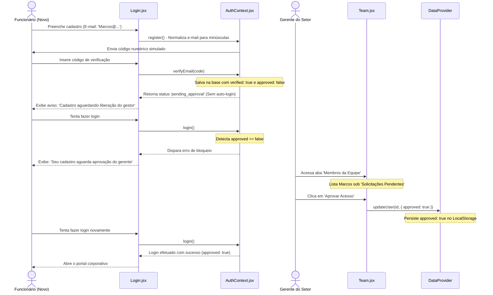

# Documento de Arquitetura do Sistema
## Gerentask — Portal Corporativo de Gerenciamento de Tarefas

---

## 1. Visão Geral da Arquitetura
O **Gerentask** foi modernizado para uma arquitetura Client-Server rodando 100% localmente. O front-end React interage de forma assíncrona com um servidor Node.js/Express leve e robusto.

Os dados de negócio são persistidos fisicamente através do backend em um arquivo estático `database.json`, evitando problemas de limite e instabilidades de bancos complexos no ambiente host local.

```mermaid
graph TD
    subgraph Cliente (Navegador)
        App[App.jsx] --> AuthProvider[AuthContext.jsx]
        App --> DataProvider[DataContext.jsx]
        
        AuthProvider --> Login[Login.jsx]
        DataProvider --> Dashboard[Dashboard.jsx]
        DataProvider --> Tasks[Tasks.jsx]
        DataProvider --> Departments[Departments.jsx]
        DataProvider --> Team[Team.jsx]
        DataProvider --> History[History.jsx]
        
        DataProvider --> NotificationCenter[NotificationCenter.jsx]
        NotificationCenter --> WebAudio[Web Audio API]
    end
    
    subgraph Servidor (Node.js)
        Server[Express API: server.js]
        Server <--> DBLogic[db.js JSON Persist]
        DBLogic <--> JSON[(database.json)]
    end
    
    DataProvider <--> Server
    AuthProvider <--> Server
```

---

## 2. Estrutura do Projeto
O diretório de desenvolvimento do código-fonte (`/src`) organiza-se de maneira modular:

```
src/
├── assets/         # Recursos estáticos (Logotipos, etc.)
├── components/     # Componentes compartilhados estruturais
│   ├── Header.jsx             # Cabeçalho da página e informações da sessão
│   ├── Sidebar.jsx            # Barra lateral de navegação e troca de tema
│   └── NotificationCenter.jsx # Sistema de Toasts e reprodução sonora
├── context/        # Contextos Globais de Estado (Providers)
│   ├── AuthContext.jsx        # Estado de autenticação e sessão do usuário
│   └── DataContext.jsx        # Ciclo de vida das entidades (Tarefas, Equipe, Setores)
├── pages/          # Telas principais da aplicação
│   ├── Dashboard.jsx          # Painel de gráficos e estatísticas
│   ├── Tasks.jsx              # Quadro Kanban interativo de tarefas
│   ├── Departments.jsx        # Gestão corporativa de departamentos
│   ├── Team.jsx               # Gestão corporativa de membros da equipe
│   └── Login.jsx              # Autenticação e tela de validação de e-mail
├── services/       # Serviços e utilitários auxiliares
│   └── db.js                  # Inicialização e leitura/escrita do LocalStorage
├── App.css         # Estilizações específicas de componentes
├── index.css       # Design System global (Variáveis CSS, Reset e Animações)
└── main.jsx        # Ponto de entrada do React
```

---

## 3. Back-End e Banco de Dados JSON Local
A camada de persistência reside no servidor Node.js no arquivo `server/db.js` interagindo com o arquivo físico `server/database.json`. Ela expõe endpoints HTTP tradicionais para o front-end via `server/server.js`.

As estruturas gerenciadas no JSON são:
- `departments`: Vetor de objetos contendo os setores da organização (id, nome, descrição).
- `users`: Vetor de objetos contendo os dados cadastrados de usuários.
  - `id`: Identificador único.
  - `name` / `email` / `password` / `role` / `departmentId`.
  - `verified`: Boolean indicando se o e-mail passou pela validação de código numérico.
  - `approved`: Boolean indicando aprovação gerencial corporativa.
- `tasks`: Vetor contendo a listagem das demandas.
  - `assignedToIds`: (Array de strings) Múltiplos responsáveis pela mesma tarefa.
- `deletionHistory`: Vetor armazenando logs de exclusão imutáveis (id, type, name, deletedBy, date).
- `notifications`: Vetor persistente de notificações e alertas. (id, title, message, taskId, userIds, read, createdAt).

---

## 4. Estado Global e Provedores (Contexts)

### 4.1. AuthContext (`AuthProvider`)
Gerencia o estado do usuário ativo e os fluxos de segurança:
- **`user`:** Objeto do usuário logado na sessão atual.
- **`login(email, password)`:** Autentica as credenciais com base nos usuários contidos na base local. Bloqueia o acesso se `user.approved === false`.
- **`register(...)`:** Registra novos funcionários de forma pendente (`approved: false`) e normaliza o e-mail para letras minúsculas (`toLowerCase`).
- **`verifyEmail(code)`:** Valida o código temporário, atualiza a conta para `verified: true` e retorna o status de pendência de aprovação (`pending_approval`) sem efetuar o login automático.

### 4.2. DataContext (`DataProvider`)
Componente centralizador que expõe os dados e funções de alteração para todas as páginas do sistema, controlando adições de tarefas (`addTask`) e membros (`addUser`) de forma higienizada (conversão de e-mails em lowercase).

---

## 5. Fluxo de Criação e Aprovação Interdepartamental (Tarefas)
- **Lógica Condicional:** Tarefas criadas por funcionários comuns ou gerentes de outros setores nascem como **Pendentes**. Apenas tarefas criadas por gerentes destinadas ao seu próprio setor nascem como **Aprovadas**.
- **Painel de Gestão (Gerente):** Identifica tarefas pendentes destinadas ao setor do gerente logado, possibilitando sua aprovação ou rejeição.
- **Painel de Acompanhamento (Funcionário):** Lista as tarefas solicitadas pelo colaborador que estejam pendentes de aprovação ou tenham sido rejeitadas por algum gerente.

---

## 6. Fluxo de Aprovação de Cadastro de Usuários (Novo)



### 6.1. Bloqueio Inteligente no Login
No [AuthContext.jsx](file:///g:/Meu%20Drive/C&S%20Sistemas/Projetos/Gerentask/src/context/AuthContext.jsx), a verificação de bloqueio utiliza comparação estrita para garantir retrocompatibilidade total com contas legadas e contas mockadas de administradores:
```javascript
if (foundUser.approved === false) {
  throw new Error('Seu cadastro está aguardando a aprovação do gerente do departamento.');
}
```
Isso impede que contas mockadas antigas que não possuem a propriedade `approved` (valor `undefined`) fiquem bloqueadas acidentalmente.

### 6.2. Painel de Aprovação no Team.jsx
No [Team.jsx](file:///g:/Meu%20Drive/C&S%20Sistemas/Projetos/Gerentask/src/pages/Team.jsx), a interface filtra e exibe novas solicitações destinadas exclusivamente ao departamento do gerente ativo:
- **Filtro:** `users.filter(u => u.approved === false && u.departmentId === user.departmentId)`
- **Ações:** O gerente interage nos cards pendentes acionando os métodos de persistência globais para atualizar a flag `approved` ou remover o cadastro do banco local em caso de recusa.
- **Filtro de Membros Ativos:** A lista comum de colaboradores oculta de forma preventiva os usuários pendentes (`u.approved === false`), listando-os somente após a validação.

### 6.3. Unicidade de E-mail Case-Insensitive
Para impedir cadastros duplicados redundantes, todas as inserções de novos e-mails (cadastro público em `AuthContext.register` e cadastro gerencial em `DataContext.addUser`) limpam espaços e forçam caracteres em caixa baixa (`email.trim().toLowerCase()`) antes da validação contra a base de usuários e antes de salvar os registros. Todas as buscas (`find` e `some`) comparam os campos normalizados.

---

## 7. Múltiplos Responsáveis e Filtros Avançados
Para comportar a flexibilidade moderna corporativa, as Tarefas possuem a propriedade de array `assignedToIds`, aposentando a associação única (1:1). 
- **Migração Dinâmica:** O DataContext assegura migração transparente carregando `t.assignedToIds = t.assignedToIds || [t.assignedToId]`.
- O renderizador do Kanban e os filtros globais aplicam a lógica de `.includes(user.id)` garantindo que a mesma tarefa co-exista na interface de diferentes responsáveis com estados perfeitamente sincronizados.

---

## 8. Exclusão e Log de Auditoria
A funcionalidade de deleção dispara a gravação no endpoint `DELETE /api/{recurso}/{id}?deletedBy={nome}`.
- O Node.js remove o objeto do array oficial de operação (Users, Departments, Tasks) e instantaneamente cria um objeto unificado no array `deletionHistory` do banco JSON.
- O Front-end consome este log através de `api.get('/history')`, processado no DataContext e renderizado na tela exclusiva de Histórico (vigiada por trava de permissão `role === 'manager'`).

---

## 9. Central de Notificações com Histórico Persistente
O sistema agora conta com um modelo persistente de notificações para manter usuários atualizados sobre mudanças cruciais nas suas tarefas.
- O componente `Header.jsx` monitora passivamente os eventos e exibe um "badge" vermelho e um menu flutuante.
- Todas as interceptações (Criação de Tarefa, Alteração de Status, Novos Comentários e Aprovações/Rejeições) são feitas de forma reativa pela central de contexto global (`DataContext.jsx`).
- Múltiplos usuários designados na mesma tarefa recebem cópias da mesma notificação usando filtragem por `.userIds`.

---

## 10. Engajamento e UX do Usuário
Recentes aprimoramentos focaram em entregar uma interface mais fluída e contextual:
- **Marcadores de "Não Lidos" nas Tarefas:** O sistema memoriza localmente (`localStorage`) o último momento em que um usuário abriu os detalhes de uma tarefa. Comentários inseridos após essa data recebem um badge e uma linha divisória de "Não Lidos", com scroll automático até a nova mensagem, melhorando o acompanhamento da thread.
- **Motivo de Rejeição Obrigatório:** Sempre que o gerente da área recusar a aprovação de uma tarefa, um prompt obrigatório coleta o "Motivo da Rejeição". Este texto é salvo no campo `rejectionReason` e exibido como alerta direto na visualização da tarefa para o criador original.
- **Cabeçalho Informativo e Otimizado:** O Header simplificou menus de ação (Meu Perfil em Dropdown) e adicionou etiquetas (`badges`) evidenciando a hierarquia corporativa do usuário (exibindo tanto o Departamento quanto o Cargo).

---

## 11. Otimização do Histórico (Logs)
- A stringificação de objetos no painel de auditoria (`History.jsx`) detecta padrões ilegíveis de sistemas (como envios de imagens e arquivos via string `base64`) ocultando-os do log bruto da interface, convertendo para tags dinâmicas como `[Nova Imagem]`, aplicando também `word-break` nos layouts em grid.
